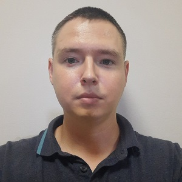

# Mikhail Pakhomov
## Contacts
* **Address:** Russia, Krasnodar Territory, Sochi
* **Phone:** +7(938)494-76-96
* **Email:** mihail93@mail.ru
* **GitHub:** https://github.com/MikhailPakhomov/
## About
I work as a communications engineer for an integrator company. I am engaged in the maintenance of PBX, dispatch communication systems, video surveillance systems. I've always been interested in programming. I had experience learning C, C++, PHP. But at the moment I realized for myself that I am interested in the frontend. I hope I will be able to learn to be a front-end developer.
## Skills
* HTML
* CSS
* JS (basic)
* React (basic)
## Code Example
```
// get radiostations list

const url = "https://de1.api.radio-browser.info/json/stations/search?countrycode=RU&limit=100&offset=0&hidebroken=true";

const [stations, setStations] = useState([]);

useEffect( () => {
    axios
        .get(url)
        .then( (response) => {
            setStations(response.data);
        })
}, []);

```
## Experience
* Social Network (learning project) (HTML, CSS, JS, React, Redux, FLUX)
    + YouTube Channel: [It-Kamasutra](https://www.youtube.com/)

